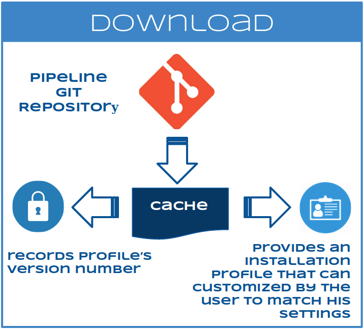
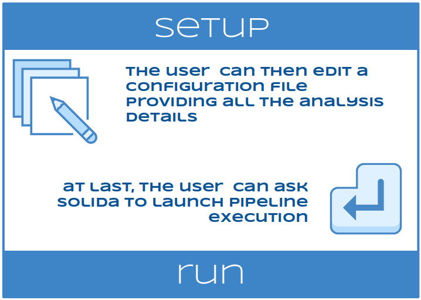
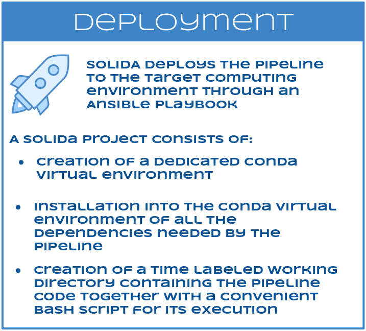
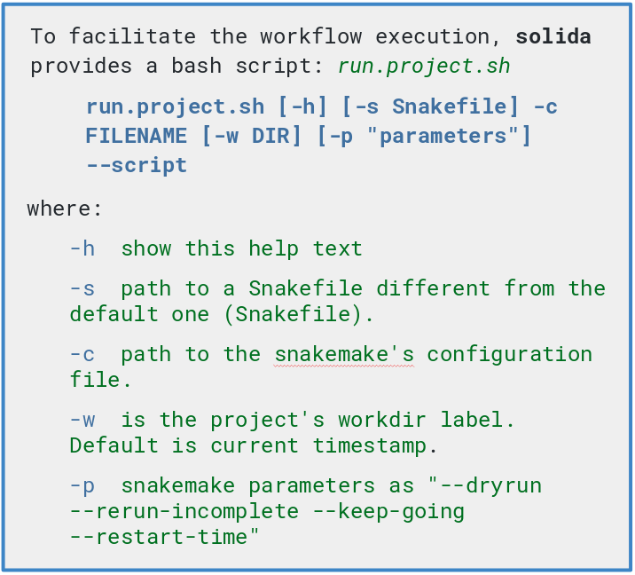

[](http://bioconda.github.io/)
[](https://snakemake.readthedocs.io/en/stable/)

# SOLIDA

To facilitate the reproducibility and portability of NGS pipelines, we have develop **[SOLIDA]()**,  a Python command-line tool that can easily organize the deployment, the data management and the execution of a Snakemake-based workflow.


### What is SOLIDA?

SOLIDA is a tool that can easily bootstrap any Snakemake workflow organizing its activity in different properly configured projects. 

Given that each project can differ for pipeline code, input data, workflow configuration, virtual environment and/or working folder, SOLIDA is able to manage all these tasks in a very simple way.


### Why should I need SOLIDA?


Download             |  Setup             |  Deploy
:-------------------------:|:-------------------------:|:-------------------------:
  |    |  


SOLIDA downloads each pipeline (e.g. exome, RNA-Seq, smallRNA-Seq) from a git repository into a cache store, records its version number and provides an installation profile that can be easily customized by the user to match his settings.


SOLIDA then deploys, for each project, the pipeline to the target computing environment through an Ansible playbook, as follows:
* creation of a dedicated Conda virtual environment
* installation into the Conda virtual environment of all the dependencies needed by the pipeline
* creation of a time labeled working directory containing the pipeline code together with a convenient bash script for its execution

The user  can then edit a configuration file providing all the analysis details and ask SOLIDA to launch its execution.
For users convenience, a set of different “ready to go” pipelines to analyze DNA-Seq (exome and targeted resequencing), RNA-Seq (reference based and pseudo-alignments) and smallRNA-Seq data have been included in SOLIDA, but others can be added quickly.

### Download and Install
You can install the latest stable version of **SOLIDA** from PyPI:
```
pip install solida
```
or you can clone the GitHub repository and install it:
```
git clone https://github.com/solida-core/solida.git
cd solida
python setup.py install
```

### Requirements

To run Solida, Conda must be present in your computer.    
To install it, see [https://conda.io/miniconda.html](https://conda.io/miniconda.html) 

### Usage

To check version:
```bash
solida -v
```

To list all the pipelines enabled, digit
```bash
solida info
```

To check if both pipeline and profile are available, digit:
```bash
solida setup -l pipeline_label -p profile_label
```

Before to deploy a pipeline, you have to create a project profile:
```bash
solida setup -l pipeline_label -p profile_label --create-profile 
```
Solida will create a yaml file named _profile_label.yaml_ into _~/solida_profiles_  
Edit the _profile_label.yaml_ to match your environment settings.

After that, deploy the pipeline into localhost with:
```bash
solida setup -l pipeline_label -p profile_label --deploy 
```
If you want to deploy the pipeline into a remote host, add these 
arguments:
```bash
solida setup -l pipeline_label -p profile_label --deploy --host remote_host 
--remote-user username --connection ssh
```
where:  
_--host_ is the hostname of the remote host  
_--remote-user_ is a username available in the remote host  
_--connection_ is the type of connection to use  

**Pay attention**: _remote_user_ have to be able to do ssh login into _remote_host_ 
without password (SSH Key-Based Authentication)

### Script to execute the workflow
Solida provides a bash script, _**run.project.sh**_, to facilitate the 
workflow execution.  



### **NEW FEATURE !**
We recently released a Django-based Graphical Interface for **SOLIDA**.
It comes within a Docker container which can be cloned from [solida-core/solida-gui](https://github.com/solida-core/solida-gui.git) GitHub page. 
